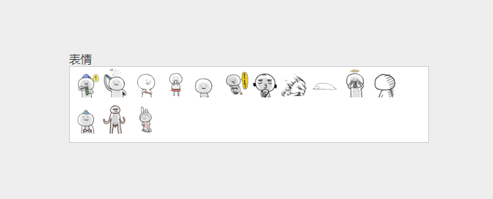

# Funny-design(HTML-CSS-JavaScript-jQuery)
Record and began to make small demo at ordinary times, mainly involves the front-end technology is JavaScript、css、html、jquery and so on.

## lightBox —— 画廊
- study by imooc course —— JS插件开发之LightBox图片画廊
- Using jQuery encapsulated into a plug-in
- Implementation effect is as follows: 

## Masonry photo wall —— 图片墙
- Using Masonry plugin
- Implementation effect is as follows: 

## funny icon —— icon图标
- the use of technology is html、 CSS
- Implementation effect is as follows: 

## Image Preloading —— 图片预加载
- study by imooc course —— 图片预加载
- Using jQuery encapsulated into a plug-in
- Included images ordered and unordered preload
- Implementation effect is as follows:   
