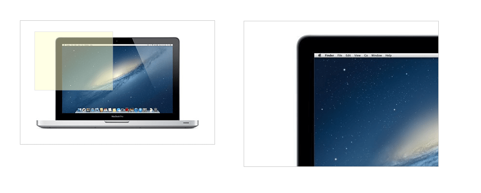
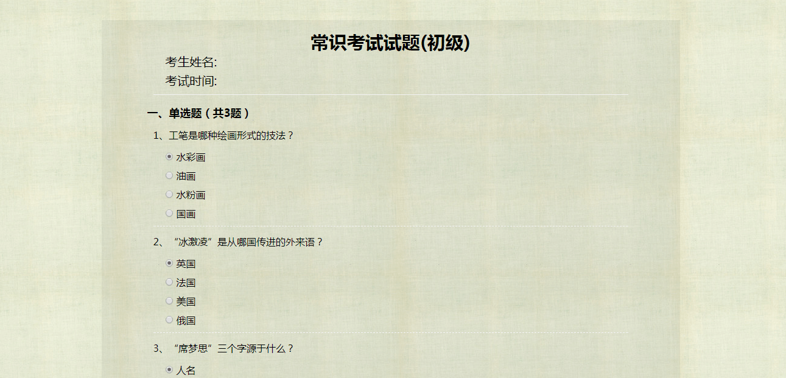

# Funny-design(HTML-CSS-JavaScript-jQuery)
Record and began to make small demo at ordinary times, mainly involves the front-end technology is JavaScript、css、html、jquery and so on.

## lightBox —— 画廊
- study by imooc course —— JS插件开发之LightBox图片画廊
- Using jQuery encapsulated into a plug-in
- Implementation effect is as follows: 

## Masonry photo wall —— 图片墙
- Using Masonry plugin

## Tooltip —— 标题气泡效果
- study by imooc course —— 使用css3实现标题气泡效果
- the use of technology is CSS3
- Using CSS 3 bubble navigation hover effect

## Guide for the first time —— 首次加载页面新手指引
- Loading page newbie guide for the first time —— study by imooc course
- 通过cookies判断是否显示新手指引，需设置cookies过期时间，有js和jq两个版本

## Js Magnify Pic —— js实现淘宝图片部分放大观看效果
- Js Magnify Pic —— study by imooc course
- 通过对位置的处理进行图片的显示

## funny icon —— icon图标
- the use of technology is html、 CSS
- icon title: 
 

## webSite smooth transition —— 使用css实现网页平滑过渡
- study by imooc course —— 使用css实现网页平滑过渡
- Using CSS to realize smooth transition
- Support page response type

## Image Preloading —— 图片预加载
- study by imooc course —— 图片预加载
- Using jQuery encapsulated into a plug-in
- Included images ordered and unordered preload

## In layout of structure and style of thinking —— 对布局结构与样式表现的思考
- 不同结构结合样式显示相同页面效果

## Examination system interface —— 考试系统试题页面
- Static layout design examination system interface implementation
