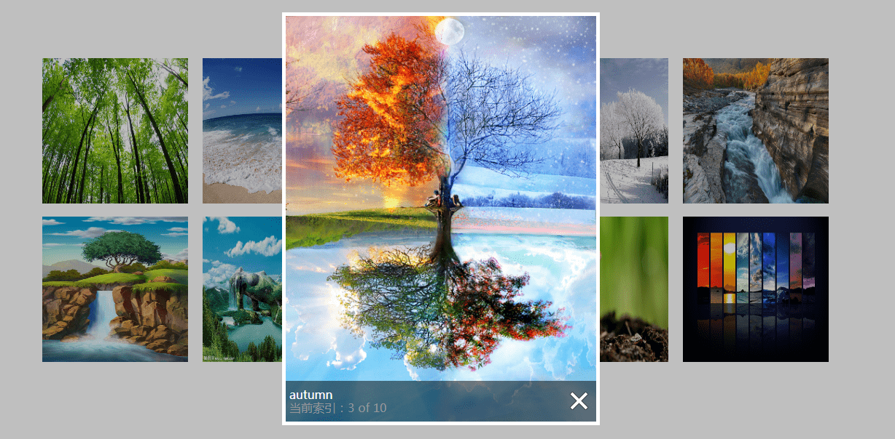

# Funny-design(HTML-CSS-JavaScript-jQuer)
Record and began to make small demo at ordinary times, mainly involves the front-end technology is JavaScript、css、html、jquery and so on.

## lightBox —— 画廊
- lightBox effect, the use of technology is js、 CSS、jquery
- Implementation effect is as follows: 